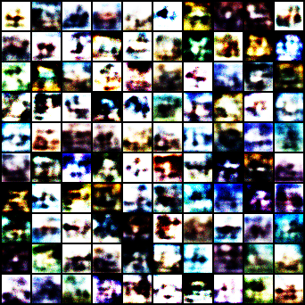

# A Collection of Generative Adversarial Networks

## 🚀 Installation
```
git clone git@github.com:chen-yuxuan/gans.git
cd gans
pip install -e .
```

## 💡 Usage

To run the default experiment setting (i.e. GAN on MNIST), run:
```bash
python main.py
```

To run your own setting, an example:
```bash
python main.py dataset=cifar10 model=wgan batch_size=64 hidden_size=512 num_epochs=50
```

Hydra provides a simple way to sweep the arguments for hyperparameter-finetuning. The following command will excute 3 * 2 * 1= 6 runs in a row:
```
python main.py batch_size=32,64,128 g_lr=1e-4,3e-4 d_lr=2e-4
```

To show the available options and the default config, do:
```bash
python main.py --help
```
which results in something like this:

```
== Configuration groups ==
Compose your configuration from those groups (group=option)

dataset: cifar10, mnist


== Config ==
Override anything in the config (foo.bar=value)

dataset:
  _target_: gans.data.mnist
  root: ./datasets/
  train: true
  download: false

model: GAN
seed: 1234
cuda_device: 0

batch_size: 100
hidden_size: 256
latent_size: 16
num_epochs: 100
g_lr: 0.0002
d_lr: 0.0001
weight_decay: 0
```

## List of GANs
### Vanilla GAN (GAN)

- Paper: [Generative Adversarial Nets](https://arxiv.org/pdf/1406.2661.pdf)
- Citation
```
@inproceedings{NIPS2014_5ca3e9b1,
 author = {Goodfellow, Ian and Pouget-Abadie, Jean and Mirza, Mehdi and Xu, Bing and Warde-Farley, David and Ozair, Sherjil and Courville, Aaron and Bengio, Yoshua},
 booktitle = {Advances in Neural Information Processing Systems},
 editor = {Z. Ghahramani and M. Welling and C. Cortes and N. Lawrence and K. Q. Weinberger},
 pages = {},
 publisher = {Curran Associates, Inc.},
 title = {Generative Adversarial Nets},
 url = {https://proceedings.neurips.cc/paper/2014/file/5ca3e9b122f61f8f06494c97b1afccf3-Paper.pdf},
 volume = {27},
 year = {2014}
}
```
- Results

|GAN on MNIST|GAN on CIFAR10|
|:-:|:-:|
|||


### Conditional GAN (CGAN)

- Paper: [Conditional Generative Adversarial Nets](https://arxiv.org/pdf/1411.1784.pdf)
- Citation
```
@misc{mirza2014conditional,
      title={Conditional Generative Adversarial Nets}, 
      author={Mehdi Mirza and Simon Osindero},
      year={2014},
      eprint={1411.1784},
      archivePrefix={arXiv},
      primaryClass={cs.LG}
}
```
- Results

|CGAN on MNIST|CGAN on CIFAR10|
|:-:|:-:|
|||


### Wasserstein GAN (WGAN)

- Paper: [Wasserstein GAN](https://arxiv.org/pdf/1701.07875.pdf)
- Citation
```
@InProceedings{pmlr-v70-arjovsky17a,
  title = 	 {{W}asserstein Generative Adversarial Networks},
  author =       {Martin Arjovsky and Soumith Chintala and L{\'e}on Bottou},
  booktitle = 	 {Proceedings of the 34th International Conference on Machine Learning},
  pages = 	 {214--223},
  year = 	 {2017},
  editor = 	 {Precup, Doina and Teh, Yee Whye},
  volume = 	 {70},
  series = 	 {Proceedings of Machine Learning Research},
  month = 	 {06--11 Aug},
  publisher =    {PMLR},
  pdf = 	 {http://proceedings.mlr.press/v70/arjovsky17a/arjovsky17a.pdf},
  url = 	 {https://proceedings.mlr.press/v70/arjovsky17a.html},
  abstract = 	 {We introduce a new algorithm named WGAN, an alternative to traditional GAN training. In this new model, we show that we can improve the stability of learning, get rid of problems like mode collapse, and provide meaningful learning curves useful for debugging and hyperparameter searches. Furthermore, we show that the corresponding optimization problem is sound, and provide extensive theoretical work highlighting the deep connections to different distances between distributions.}
}
```

- Results

|WGAN on MNIST|WGAN on CIFAR10|
|:-:|:-:|
|||


### Deep Convolutional GAN (DCGAN)

- Paper: [Unsupervised Representation Learning with Deep Convolutional Generative Adversarial Networks](https://arxiv.org/pdf/1511.06434.pdf)
- Citation

```
@inproceedings{DBLP:journals/corr/RadfordMC15,
  author    = {Alec Radford and
               Luke Metz and
               Soumith Chintala},
  editor    = {Yoshua Bengio and
               Yann LeCun},
  title     = {Unsupervised Representation Learning with Deep Convolutional Generative
               Adversarial Networks},
  booktitle = {4th International Conference on Learning Representations, {ICLR} 2016,
               San Juan, Puerto Rico, May 2-4, 2016, Conference Track Proceedings},
  year      = {2016},
  url       = {http://arxiv.org/abs/1511.06434},
  timestamp = {Thu, 25 Jul 2019 14:25:38 +0200},
  biburl    = {https://dblp.org/rec/journals/corr/RadfordMC15.bib},
  bibsource = {dblp computer science bibliography, https://dblp.org}
}
```

### StarGAN
- Paper: [StarGAN: Unified Generative Adversarial Networks for Multi-Domain Image-to-Image Translation](https://arxiv.org/pdf/1711.09020.pdf)
- Citation:
```
@inproceedings{DBLP:conf/cvpr/ChoiCKH0C18,
  author    = {Yunjey Choi and
               Min{-}Je Choi and
               Munyoung Kim and
               Jung{-}Woo Ha and
               Sunghun Kim and
               Jaegul Choo},
  title     = {StarGAN: Unified Generative Adversarial Networks for Multi-Domain
               Image-to-Image Translation},
  booktitle = {2018 {IEEE} Conference on Computer Vision and Pattern Recognition,
               {CVPR} 2018, Salt Lake City, UT, USA, June 18-22, 2018},
  pages     = {8789--8797},
  publisher = {Computer Vision Foundation / {IEEE} Computer Society},
  year      = {2018},
  url       = {http://openaccess.thecvf.com/content\_cvpr\_2018/html/Choi\_StarGAN\_Unified\_Generative\_CVPR\_2018\_paper.html},
  doi       = {10.1109/CVPR.2018.00916},
  timestamp = {Tue, 31 Aug 2021 14:00:32 +0200},
  biburl    = {https://dblp.org/rec/conf/cvpr/ChoiCKH0C18.bib},
  bibsource = {dblp computer science bibliography, https://dblp.org}
}
```